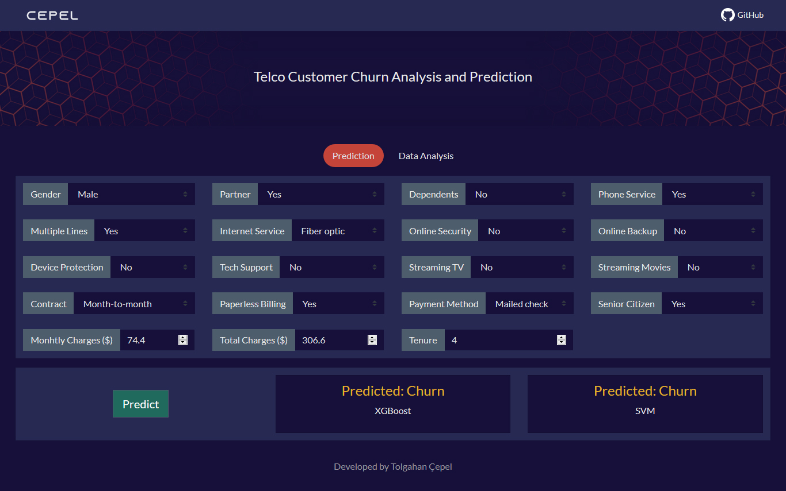
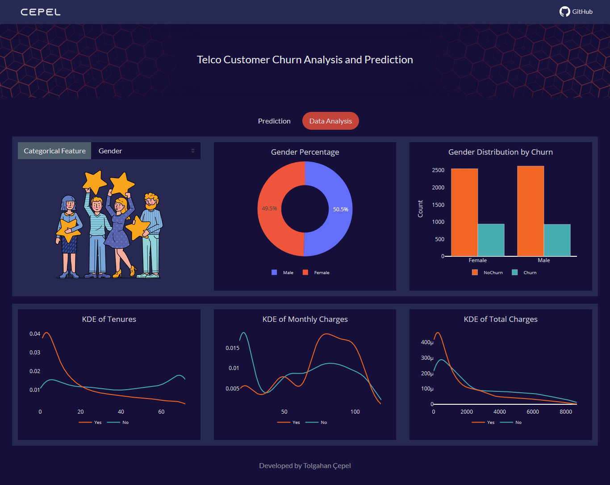

## Telco Customer Churn Prediction - Plotly Dash Application
Live on Heroku: https://cepel-customer-churn.herokuapp.com/  

### Description
This dash application allows you to predict telco customer churn using machine learning algorithms (SVM, XGBoost). Developed with Python and the all codes published on GitHub. Feel free to review and download the repository. You can:
- predict customer churn
- review data analysis

**Dataset:** https://github.com/IBM/telco-customer-churn-on-icp4d/blob/master/data/Telco-Customer-Churn.csv

### Installation and Usage
1. Install all dependencies listed in requirements.txt - all packages are pip-installable.
2. Run app.py to launch a local Dash server to host the Dash app. A link will appear in your console; click this to use the Dash app.

### Screenshots

